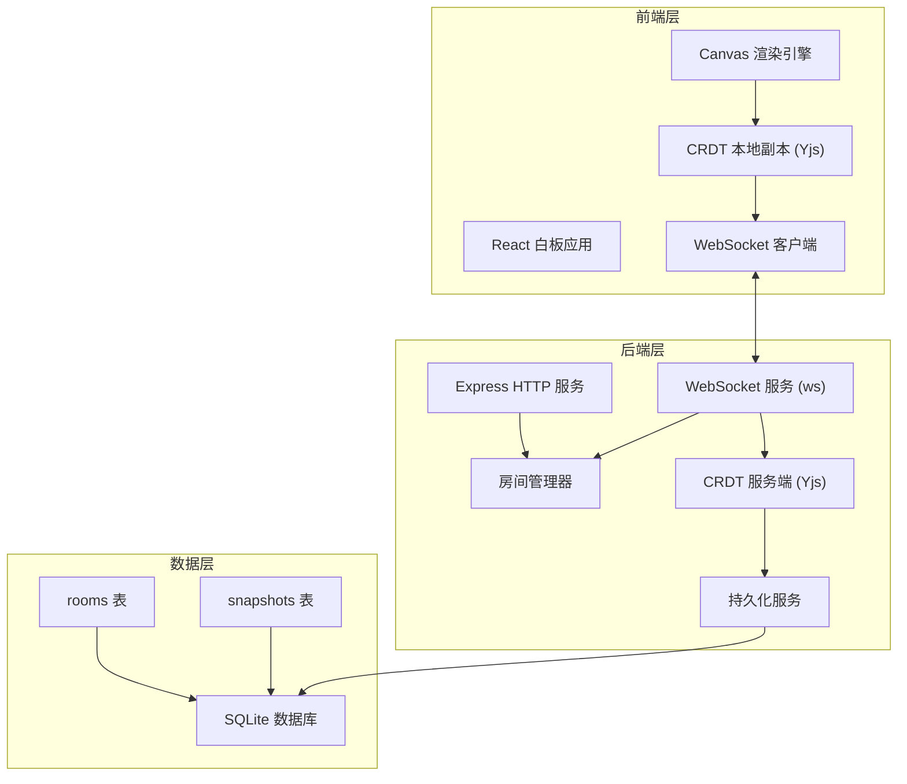
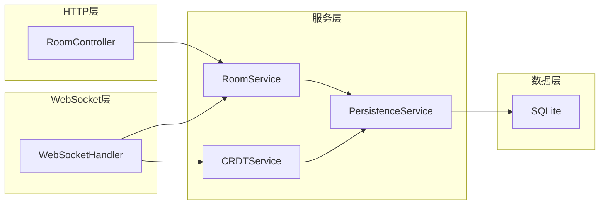

## 1. 架构设计



## 2. 技术说明

- 前端：React@18 + TypeScript + TailwindCSS@3 + Vite
- 初始化工具：Vite (react-ts template)
- 后端：Express@4 + ws (WebSocket) + y-websocket
- CRDT：Yjs（成熟的CRDT库，支持多种数据类型，有WebSocket绑定）
- 数据库：SQLite (better-sqlite3)
- 画布渲染：HTML5 Canvas API + 自定义渲染引擎
- 状态管理：Zustand

## 3. 路由定义

| 路由 | 用途 |
|------|------|
| / | 房间管理页（创建/加入房间） |
| /room/:roomId | 白板工作台（绘图协作主界面） |

## 4. API 定义

### 4.1 HTTP API

```typescript
// 创建房间
POST /api/rooms
Request: { name: string; password?: string }
Response: { roomId: string; name: string }

// 获取房间列表
GET /api/rooms
Response: Array<{ roomId: string; name: string; hasPassword: boolean; userCount: number }>

// 验证房间密码
POST /api/rooms/:roomId/verify
Request: { password: string }
Response: { valid: boolean; token: string }

// 获取房间快照（用于恢复状态）
GET /api/rooms/:roomId/snapshot
Headers: { Authorization: Bearer <token> }
Response: { data: Uint8Array; timestamp: number }
```

### 4.2 WebSocket 消息协议

```typescript
// 客户端 -> 服务端
type ClientMessage =
  | { type: "join"; roomId: string; token: string; userName: string }
  | { type: "sync"; roomId: string; update: Uint8Array }
  | { type: "cursor"; roomId: string; x: number; y: number }

// 服务端 -> 客户端
type ServerMessage =
  | { type: "welcome"; users: Array<{ id: string; name: string; color: string }> }
  | { type: "sync"; update: Uint8Array; sourceClientId: string }
  | { type: "cursor"; userId: string; x: number; y: number }
  | { type: "user-joined"; user: { id: string; name: string; color: string } }
  | { type: "user-left"; userId: string }
```

### 4.3 CRDT 数据模型 (Yjs)

```typescript
// Yjs 共享文档结构
interface WhiteboardYDoc {
  // 图形元素数组（YArray 保证有序且可并发编辑）
  elements: Y.Array<DrawingElement>

  // 绘图元素类型
  // 每个元素包含：id, type, props, createdBy, createdAt
}

type DrawingElement =
  | { id: string; type: "freehand"; points: Array<{x: number; y: number}>; color: string; lineWidth: number; createdBy: string }
  | { id: string; type: "line"; start: {x: number; y: number}; end: {x: number; y: number}; color: string; lineWidth: number; createdBy: string }
  | { id: string; type: "rect"; x: number; y: number; width: number; height: number; color: string; lineWidth: number; fill: string; createdBy: string }
  | { id: string; type: "circle"; cx: number; cy: number; radius: number; color: string; lineWidth: number; fill: string; createdBy: string }
  | { id: string; type: "text"; x: number; y: number; content: string; fontSize: number; color: string; createdBy: string }
```

## 5. 服务端架构图



## 6. 数据模型

### 6.1 数据模型定义

```mermaid
erdiagr
    ROOM {
        string id PK
        string name
        string password_hash
        datetime created_at
        datetime updated_at
    }
    SNAPSHOT {
        string id PK
        string room_id FK
        blob data
        datetime created_at
    }
    ROOM ||--o{ SNAPSHOT : has
```

### 6.2 数据定义语言

```sql
CREATE TABLE rooms (
    id TEXT PRIMARY KEY,
    name TEXT NOT NULL,
    password_hash TEXT,
    created_at DATETIME DEFAULT CURRENT_TIMESTAMP,
    updated_at DATETIME DEFAULT CURRENT_TIMESTAMP
);

CREATE TABLE snapshots (
    id TEXT PRIMARY KEY,
    room_id TEXT NOT NULL REFERENCES rooms(id) ON DELETE CASCADE,
    data BLOB NOT NULL,
    created_at DATETIME DEFAULT CURRENT_TIMESTAMP
);

CREATE INDEX idx_snapshots_room_id ON snapshots(room_id);
CREATE INDEX idx_snapshots_created_at ON snapshots(created_at);
```
